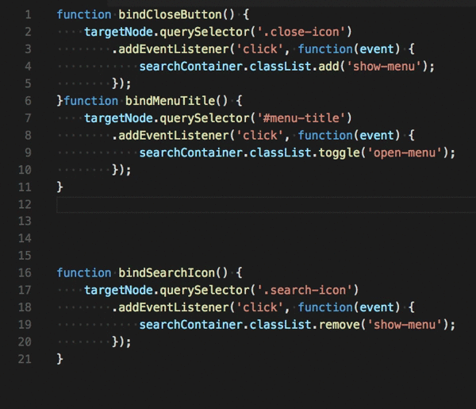

# Blank Line Organizer

This extension will help you organize blank lines in the code by removing multiple blank lines. The extension removes blank lines only from the selected lines if any, otherwise from the entire file.

## Demo



## Usage

Press `Ctrl + ;` / `Cmd + ;`

or

Enter `Ctrl/Cmd + P` search for `> Remove blank lines`

## Configuration

| Configuration                   | Type      | Default Value | Description
| ------------------------------- | --------- | ------------- | -----------------------------
| blankLine.keepOneEmptyLine      | `boolean` | `true`        | Set to false to remove all blank lines or true to keep one.
| blankLine.triggerOnSave         | `boolean` | `true`        | If set to true, the command will be triggered on save.
| blankLine.insertLineAfterBlock  | `boolean` | `true`        | If set to true, inserts an blank line after a block statement. This has no effect if `keepOneEmptyLine` is set to `false`.
| blankLine.languageIds           | `string[]`| `["javascript", "typescript", "json", "css", "scss"]` | Trigger this command on save, only if current language-id is in the list

NOTE: By default the extension is configured to format on save, you can disable this by setting `blankLine.triggerOnSave` to `false`.

## Contributing

Contributions are very welcome! Just send a pull request. Feel free to contact me or checkout my [Github](https://github.com/rintoj/blank-line-organizer) page.

## Author

**Rinto Jose** (rintoj)

Follow me:
  [Github](https://github.com/rintoj)
| [Facebook](https://www.facebook.com/rinto.jose)
| [Twitter](https://twitter.com/rintoj)
| [Google+](https://plus.google.com/+RintoJoseMankudy)
| [Youtube](https://youtube.com/+RintoJoseMankudy)

## License

```
The MIT License (MIT)

Copyright (c) 2016 Rinto Jose (rintoj)

Permission is hereby granted, free of charge, to any person obtaining a copy
of this software and associated documentation files (the "Software"), to deal
in the Software without restriction, including without limitation the rights
to use, copy, modify, merge, publish, distribute, sublicense, and/or sell
copies of the Software, and to permit persons to whom the Software is
furnished to do so, subject to the following conditions:

The above copyright notice and this permission notice shall be included in
all copies or substantial portions of the Software.

THE SOFTWARE IS PROVIDED "AS IS", WITHOUT WARRANTY OF ANY KIND, EXPRESS OR
IMPLIED, INCLUDING BUT NOT LIMITED TO THE WARRANTIES OF MERCHANTABILITY,
FITNESS FOR A PARTICULAR PURPOSE AND NONINFRINGEMENT. IN NO EVENT SHALL THE
AUTHORS OR COPYRIGHT HOLDERS BE LIABLE FOR ANY CLAIM, DAMAGES OR OTHER
LIABILITY, WHETHER IN AN ACTION OF CONTRACT, TORT OR OTHERWISE, ARISING FROM,
OUT OF OR IN CONNECTION WITH THE SOFTWARE OR THE USE OR OTHER DEALINGS IN
THE SOFTWARE.
```

**Enjoy!**
